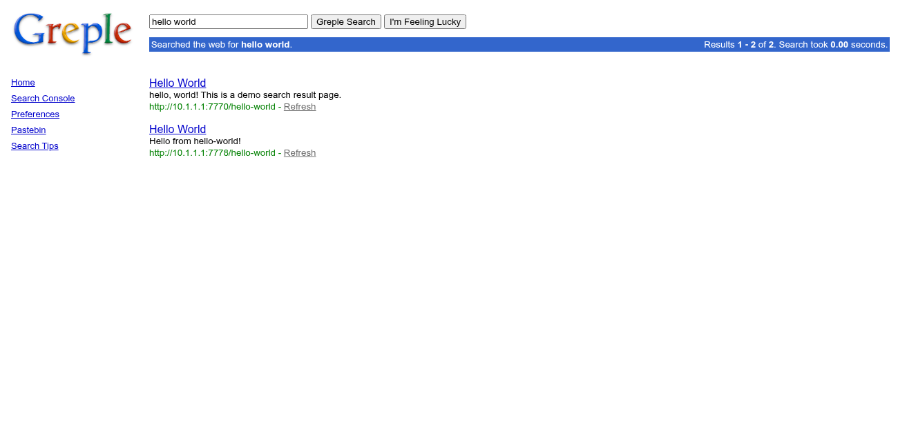
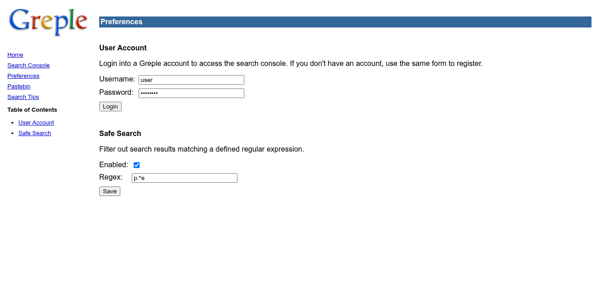
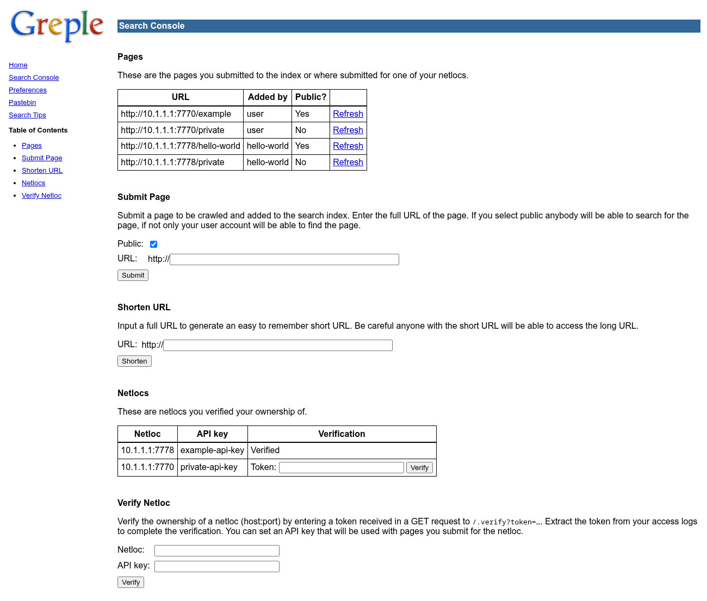
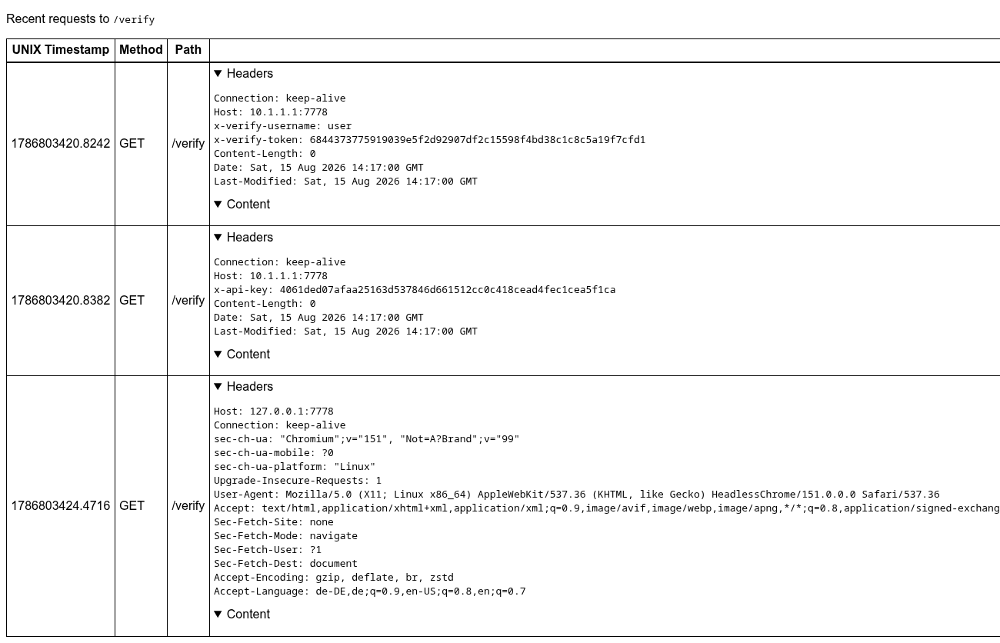

# Documentation

- [Local Installation](#local-installation)
- [Docker Container](#docker-container)
- [Main Service](#main-service)
- [Echo Server](#echo-server)
- [Flagstore 0: Missing HMAC domain separation](#flagstore-0-missing-hmac-domain-separation)
- [Flagstore 1: RegEx timing side channel](#flagstore-1-regex-timing-side-channel)
- [Flagstore 2: HTTP request smuggling](#flagstore-2-http-request-smuggling)

## Local Installation

1. Clone the repository.
2. Start the service from the `service/` folder and put it on the shared `eno`
   bridge network. The service crawler only fetches origins on private
   `10.0.0.0/8` addresses, so the service is attached to a `eno` network:
   ```
   (cd service && docker compose up --build -d)
   docker network create --subnet 10.0.0.0/8 eno
   docker network connect --ip 10.1.1.1 eno greple_service-greple-1
   ```
3. *(optional)* Start the checker, join it to the same network, and use
   `enochecker_test` to place one example ASCII flag into each of the three
   flagstores:
   ```
   (cd checker && docker compose up --build -d)
   docker network connect eno greple_checker-greple-checker-1
   pip install enochecker_test
   enochecker_test --checker-address 127.0.0.1 --checker-port 17777 \
     --service-address 10.1.1.1 --flag-types ascii test_putflag[
   ```
4. Access the main service under port `7777` using HTTP at
   `http://10.1.1.1:7777`.

## Docker Container

The service consists of three processes running in one shared docker container.
The container is build from `service/Dockerfile` (Alpine 3.23, two-stage build)
and started via `service/docker-compose.yml`. The container exposes the ports
`7770-7778` and persists its state to the `/data` volume.

### Build Process

The build stage compiles all binaries with Zig 0.15.2 from Alpine 3.23 using a
`zig build` call. Note that this lets Zig detect the *builder machine's* CPU and
emit instructions for it e.g. in the SHA-2 implementation (native CPU target).
The resulting binary and therefore the whole Docker container is not portable
across CPUs.

**If deployed as a pre-built image (e.g. with
[bambictf](https://github.com/enowars/bambictf)) the builder machine needs to
match the deployment target machine.**

### Entry Point

On startup of the container the directories `documents`, `netlocs`, `index`,
`pastes`, `urls`, and `users` are created by `service/entrypoint.sh` inside the
`/data` volume of the container.

### Processes

The container runs three processes under `multirun`:

- `/greple`: the main service ([Main Service](#main-service))
- `python /echo.py`: a helper service ([Echo Server](#echo-server))
- `/cron`: a periodic cleanup helper that removes stale user data

## Main Service

The main service is a Zig web server using [zap](https://github.com/zigzap/zap)
as the web framework. The search index is stored as text files in the
`documents` folder and queried using `grep`. The main service is reachable using
HTTP/1.1 on port `7777`.

The zap web framework for Zig has a bug when interpreting request parameters.
The data type of parameters is inferred based on their value. That means that
for parameters that are meant to be strings the following interpretation bugs
change the string value. The following examples are all case insensitive.

- `null` becomes `unknown_type`
- `true` or `false` get converted to lowercase
- `nan` gets converted to `NaN`
- `inf` or `infinity` becomes `Infinity`
- `-inf` or `-infinity` becomes `-Infinity`
- `-0` becomes `0`
- `-?0?b[01]+` is interpreted as binary e.g. `b10` becomes `2`
- `-?0[0-7]+` is interpreted as octal e.g. `010` becomes `8`
- `-?0?x[0-9a-f]+` is interpreted as hexadecimal e.g. `x10` becomes `16`
- all numbers are interpreted without the sign as 64 bit unsigned integers
  first; overflowing if `>= 2^64`, then the number is truncated to `< 2^63`
  (`INT64_MAX`) before the sign is reintroduced e.g. `18446744073709551615`
  (`2^64-1`) becomes `9223372036854775807` (`2^63-1`) and
  `18446744073709551615` (`2^64`) becomes `0`

Except for the first two examples all others also strip white space while normal
strings don't get their white space removed. These bugs where not fixed by the
implementation of the service and were worked around in the A/D-CTF challenges
e.g. by removing words like *null* from the corpus of the checker.

The main service has the following HTTP pages:

### Homepage (`/`)

The search homepage of the Greple service. The user can use the form field to
enter a search query and the *Greple search* or *I'm feeling lucky* button to
search. Both take the user to the `/search` endpoint. This page also shows the
current search index size.


### Search Results (`/search`)

The `/search` endpoint displays search results for a search query or redirects
to the URL of the first search result if the user used the *I'm feeling lucky*
button. The query syntax is documented for the user under `/help`.

The side bar of this page (also shown on most other pages) has links to e.g.
`/help`.

The search results displayed have a *Refresh* link next to their URL. If
clicked the page of the search result is crawled again using the users queue.
The number of results and the search time are also displayed.



### Preferences (`/preferences`)

The preferences page provides account login and safe search configuration. It
is available without authentication.

The login form POSTs to `/user_account` with `username` and `password`; it
creates a new account or logs into an existing one, sets the `user_account`
session cookie, and redirects back to `/preferences`. The `user_account`
cookie is protected from tampering with HMAC.

The safe search form POSTs to `/safe_search` with `enabled` (optional
presence) and `regex`; it sets the `safe_search` cookie and redirects back to
`/preferences`. The `safe_search` cookie is always trusted and discarded if
invalid.



### Search Console (`/console`) _(login)_

The Search Console shows the user's submitted pages and netlocs. The *Pages*
table lists indexing entries, either submitted by the user or submitted for a
netloc the user has verified. The table shows the entries URL, submitter,
public/private status, and a refresh link. The *Netlocs* table displays
submitted netlocs with their API key and verification status. All POST actions
on this page require a valid `user_account` cookie.

The *Submit Page* form POSTs to `/submit_page` with `url`
(`host[:port]/path`, required) and `public` (optional, absent indexes
privately). It redirects to `/queue`.

The *Verify Netloc* form POSTs to `/verify_netloc` with `netloc`
(`host[:port]`, required) and `api_key` (required). It redirects to `/console`.

The *Token Completion* form POSTs to `/token` with `hash` (required) and
`token` (required). The token is sent by the crawler in the `x-verify-token`
header, observable on the logger (port 7778). It redirects to `/console`.

The *Shorten URL* form POSTs to `/shorten_url` with `url`
(`host[:port]/path`, required) and returns a page displaying the shortened
URL at `http://<host>/u/<hash>`. Note: the endpoint itself does not require
authentication, even though the form is embedded in the authenticated console.



### Queue (`/queue`) _(login)_

The queue displays pending crawl and verification jobs for the logged-in user.
Each entry shows an index number, the type (crawl or verify), and the target
URL or netloc. The page auto-refreshes while entries are pending and redirects
to `/console` when the queue is empty.

Crawl entries re-index a page. They are created by submitting the *Submit Page*
form on `/console` or by clicking the *Refresh* link on search results. The
crawler sends a `GET` to the target URL with the owner's `x-api-key` header,
extracts the `title` and `p` text, and updates the index.

Verify entries confirm netloc ownership. They are created by submitting the
Verify Netloc form on `/console`. The crawler sends a `GET /verify` request
with `x-verify-username` and `x-verify-token` headers.


### Pastebin (`/pastebin`)

The pastebin lets users host text snippets on the server for a limited time.
The form accepts a title and text body. On submission the paste is stored and
the browser is redirected to its permalink at `/p/<hash>`. Pastes are
automatically removed by a periodic cleanup job. No authentication is required
to create or view pastes.

### Search Tips (`/help`)

The `/help` page documents the search query syntax. Greple performs a literal
text search across indexed pages. Multiple words form a phrase that must appear
adjacent to each other in the page. A query prefixed with `user:<name>`
restricts results to pages submitted by that user. Searches are not case
sensitive and do not support stemming or wildcards. The *I'm Feeling Lucky*
button takes the user directly to the top-ranked result.

## Echo Server

The echo server is a small companion service inside the greple container. It
serves the placeholder origin targets used as netlocs and the request logger
that records incoming crawls.

### OK servers (ports `7770-7776`)

A separate listener runs on every port from `7770` through `7776`. All of them
behave identically: every request receives a static `OK` HTML page as the
response, regardless of method, path, or headers.


### Logger server (port `7778`)

The logger accepts every request and returns a static `OK` HTML page that
contains a link to the current path with `.logs` appended (e.g. a request to
`/crawl` links to `/crawl.logs`).

Any request whose path ends in `.logs` turns into the logger view for the
path without the suffix. For example, `/crawl.logs` shows the logged requests
for `/crawl`. The logger view is an HTML table with one row per logged
request:

- UNIX timestamp
- HTTP method
- Request path
- Headers
- Request body rendered as a hexdump with an ASCII column

The `.logs` request itself is not logged. All logged requests are held in an
in-memory queue that keeps only the last 20 seconds; entries older than that
are pruned on every incoming request.

Two transformations are applied before a request is stored:

- The `cookie` header is always dropped.
- The `x-api-key` header value is replaced by its SHA-224 hex digest, so API
  keys never appear in plain text in the logs.



## Flagstore 0: Missing HMAC domain separation

- Expected difficulty: Easy
- Category: Cryptography

### How the flag is placed

A victim registers an account and submits a *private* page for indexing whose
URL points at one of the OK servers, with the flag percent-encoded into the URL
path. Private pages are normally only visible to their owner and to accounts
that have verified ownership of the page's netloc.

The attacker is handed a single value: the target netloc (`host:port`, e.g.
`10.1.1.1:7775`).

### The vulnerability

One service-wide `HMAC(key, input)` key is used for two different
authentications, with nothing to tell the two contexts apart:

- A session cookie carries `username=<user>&hmac=<hex HMAC(key, user)>`.
- A netloc verification token is `<hex HMAC(key, user ++ "host:port")>`, where
  `host:port` is the textual netloc.

`HMAC(key, "user" ++ "10.1.1.1:7775")` also happens to be exactly the
verification token for user `user` on netloc `10.1.1.1:7775`. A session HMAC
issued for the combined username `user10.1.1.1:7775` can therefore be
replayed as that verification token.

### Exploit

Given `netloc = host:port`, e.g. `10.1.1.1:7775`:

1. **Steal a token.** Register with username `<prefix><netloc>`, e.g.
   `user10.1.1.1:7775`, and read the `hmac` field from the returned
   `user_account` cookie. This registers fine because the username validation
   regex `[\w+-=]+` treats `+-=` as a character *range* from `+` to `=` (not the
   three literal characters), so the allowed characters include `.`, `/`, `:`,
   `;`, `<`, `=` and the digits, i.e. everything a `host:port` netloc needs.
   The value equals `HMAC(key, "user10.1.1.1:7775")`.
2. **Switch to the bare prefix.** Log in again with only `<prefix>` (e.g.
   `user`); the remaining requests use this session.
3. **Create the netloc record** with the bare-prefix session via
   `/verify_netloc` (`netloc=10.1.1.1:7775`, any `api_key`). This queues a
   harmless verification request and creates the netloc under `user`. The
   resulting page contains the netloc's hash inside a hidden input field for
   verification in `value="<56-hex hash>"`.
4. **Complete verification.** `POST /token` with `hash=<that 56-hex hash>` and
   `token=<the hmac from step 1>`. It matches, so the netloc becomes verified.
5. **Read the flag.** Open the Search Console as `user`; the pages table lists
   every page pointing at `10.1.1.1:7775`, including the victim's private one.
   URL-decoding the page URL can reveal the flag.

### Fix

Signatures from one context must be invalid in the other. Add domain separation
labels to the HMAC inputs, e.g.:

- `HMAC(key, "session", username)` for cookies
- `HMAC(key, "netloc", username host ":" port)` for verification

#### Minimal patch

`utils.hmac` takes a domain label:

```diff
--- a/service/src/utils.zig
+++ b/service/src/utils.zig
-pub fn hmac(data: []const u8) Hmac {
+pub fn hmac(domain: []const u8, data: []const u8) Hmac {
+    var ctx = HmacFn.init(key);
+    ctx.update(domain);
+    ctx.update(data);
     var h: Hmac = undefined;
-    HmacFn.create(&h, data, key);
+    ctx.final(&h);
     return h;
 }
```

Call sites pass distinct labels:

```diff
--- a/service/src/User.zig
+++ b/service/src/User.zig
-        if (std.mem.eql(u8, &h, &utils.hmac(u))) {
+        if (std.mem.eql(u8, &h, &utils.hmac("session", u))) {
-    try value.writer.printHex(&utils.hmac(self.username), .lower);
+    try value.writer.printHex(&utils.hmac("session", self.username), .lower);
--- a/service/src/Netloc.zig
+++ b/service/src/Netloc.zig
-    return std.fmt.bytesToHex(utils.hmac(inp.written()), .lower);
+    return std.fmt.bytesToHex(utils.hmac("netloc", inp.written()), .lower);
```

## Flagstore 1: RegEx timing side channel

- Expected difficulty: Medium
- Category: Side channel attack

### How the flag is placed

A victim registers an account and shortens `http://<host>/<percent-encoded
flag>` to a short URL `/u/<hash>`; the hash is 16 hex characters, and `GET
/u/<hash>` redirects to the long URL. The victim then creates a paste whose
body is exactly that short URL and submits the paste to the index as a
*private* page. The paste and its short URL are ordinarily only visible to the
owner.

The attacker is handed the query `user:<username>` of the victim. That query
matches the victim's paste.

### The vulnerability

Search results are filtered through two independent checks, in an order that
allows probing:

1. The safe-search RegEx (attacker-controlled via the `safe_search` cookie)
   is applied to every matched document text.
2. Only afterwards is ownership checked: private documents from other
   submitters are dropped.

Because the RegEx runs first, it can be used to probe the contents of private
documents before they are removed. The RegEx engine is a severely backtracking
one, and the page also reports the search duration in the
`title="<milliseconds> ms"` attribute, so there is a timing side channel. A
RegEx can often be arranged so that a match is fast and a no-match is slow,
turning search time into a binary "did my RegEx match that text" oracle on the
hidden paste.

### Exploit

**Calibrate the oracle** (once, on your own data):

1. Register an account and create a paste whose body is a known short URL
   `/u/<16 known chars>`; submit that paste privately to the index, mirroring
   the victim's layout.
2. The probe RegEx anchors on the fixed prefix `/u/`. Split it at its middle
   character (`"/u/"` → leading `/`, middle `u`, trailing `/`) and build a
   ReDoS `"/" + "u*"*k + "/"`, then append the character-class expression
   under test. Repeating `u*` is what tends to make the timing diverge;
   without the amplification the base probe runs in fairly constant time.
3. The amplified regex is the whole value sent for every probe. For example, a
   probe matching when the short URL's character `idx` is in `letters`
   (`k = 3`, `idx = 3`) looks like:

   ```
   /u*u*u*/[0123456789abcdef]{3}[0123456789abcdef][0123456789abcdef]{12}
   ```

   Each probe must run with safe search enabled: set the `safe_search` cookie
   value to `enabled=on&regex=<percent-encoded regex>`. Then `GET
   /search?q=user:<victim>` and read the reported `title="X ms"`.

4. For increasing `k`, sample timings of searches that match the known short
   URL vs. those that don't (both through the amplified regex) and train a
   binary classifier on the observed times. Once the classifier separates match
   from no-match, keep that `k` and the classifier for the session.

**Recover the 16 characters** of `/u/<hash>`:

For each position `idx` in `0..16`, binary-search the alphabet. For a candidate
leading half `alphabet[lo:mid]`, the full-length probe (appended to the ReDoS
prefix) matches exactly when the `idx`-th character lies in `alphabet[lo:mid]`:

```
/u*u*...u*/[0123456789abcdef]{idx}[<alphabet[lo:mid]>][0123456789abcdef]{16-idx-1}
```

Time the search and let the classifier say whether it matched; this halves the
search space, so each character needs 4 timed requests (log2 16).

**Resolve and read the flag:**

1. `GET /u/<the 16 recovered characters>` returns a `302` whose `Location` is
   the long URL.
2. Percent-decoding it reveals the flag in the path.

### Fix

Check document ownership before applying the safe-search RegEx. Private
documents never reach the attacker-controlled filter.

#### Minimal patch

Move the regex filter below the ownership check in `aggregateResults`:

```diff
--- a/service/src/search.zig
+++ b/service/src/search.zig
@@
-        if (regex) |*r| if (r.isMatch(text)) continue;
-
         const user_hash = if (query.user_hash) |u| u else try
             utils.hexToBytes(@sizeOf(utils.Hash), dirname.?);
@@
         if (!owner_match and !index_entry.public) {
             alloc.free(index_entry.url.host);
             alloc.free(index_entry.url.path);
             alloc.free(index_entry.title);
             continue;
         }
 
+        if (regex) |*r| if (r.isMatch(text)) continue;
+
         const result = try results.getOrPut(url_hash);
```

## Flagstore 2: HTTP request smuggling

- Expected difficulty: Hard
- Category: HTTP request smuggling

### How the flag is placed

A victim registers an account and calls `/verify_netloc` with the logger as the
origin (`<host>:7778`) and the flag as the `api_key` value; the netloc stays
unverified, since crawls attach API keys from unverified netlocs as well. The
victim also submits a private page pointing at `<host>:7778/<path>`, so feeding
that entry through the crawler attaches `x-api-key: FLAG`. The flag is shown in
the API-key column of the Search Console for that netloc.

The attacker is handed a single value: the victim's entry refresh hash (56
hex characters) from their `/submit_page`.

### The vulnerability

A few properties can combine into a request-smuggling primitive:

1. **Unsanitized API keys.** The netloc's `api_key` is copied verbatim into the
   `x-api-key` header of the crawl, without filtering `\r`/`\n`.
2. **Connection reuse.** A single HTTP connection is kept open and reused
   across the crawl/verify jobs an account queues, so the attacker's and the
   victim's re-crawled requests can share one connection.
3. **Unchecked refresh.** `POST /refresh` re-queues an index entry by its
   `hash` on the *requesting* user's own crawler connection, with no ownership
   check. Re-crawling the victim's entry thereby attaches the victim's
   `x-api-key: FLAG` to a request that runs on the attacker's connection.
4. **Logging.** The logger records the request bodies it receives; API keys in
   the `x-api-key` *header* are replaced by their SHA-224 digest, but the body
   itself is stored unredacted.

### Exploit

The attack runs on the attacker's own crawler connection, starting from their
already-registered account. It needs five steps.

1. **Determine `<CL>`.** The logger reads `<CL>` bytes as the body of the
   injected `POST /dump`. These bytes begin with facil.io's trailing headers of
   your own poisoned request (`content-length:0`, `date`, `last-modified`; no
   space after the colon, ~100 bytes) and continue into the victim's crawl GET.
   `<CL>` must be large enough to cover the flag but never exceed that total,
   or the logger waits forever and nothing is captured. So set `<CL>` to the
   trailing headers plus the victim's whole request, a value that always
   completes. To measure it, capture the crawler's GET once on an origin you
   control (same path and `api_key` length as the victim's) and adjust for the
   victim's `host:port` and flag length. (Reading a byte count from
   `/<path>.logs` does not work: logged GETs have empty bodies.)
2. **Create the index entry and netloc with a poisoned API key.** Submit a
   private page pointing at the logger
   (`POST /submit_page` with `url=<host>:7778/<some path>`) to create an index
   entry for `<host>:7778`. Then create the netloc for the logger with the
   poisoned key (`POST /verify_netloc` with `netloc=<host>:7778` and the
   payload below as `api_key`), using the `<CL>` measured in step 1.
   Verifying does not matter; the API key is used for crawls whether or not
   the netloc is verified:

   ```
   \r\n\r\n
   POST /dump HTTP/1.1
   host: <host>:7778
   content-length: <CL>
   \r\n
   ```

   (`\r\n` must be percent-encoded as `%0d%0a` when submitted as a form value.)
3. **Crawl your own page.** `POST /refresh` with your own entry's hash. The
   crawler copies the poisoned `api_key` verbatim into the `x-api-key` header,
   so the wire carries the normal crawl GET immediately followed by a fresh
   `POST /dump`. The `\r\n\r\n` inside the key ends the GET and starts the
   `POST /dump`; the logger reads `content-length:<CL>` bytes as its body, so
   `POST /dump` is still open when this crawl finishes. The next job has to be
   already queued, so the crawler keeps the same connection to the logger open.
4. **Crawl the victim's page.** Directly afterwards, `POST /refresh` with the
   victim's entry hash. It re-queues the victim's entry on the same connection,
   so the victim's crawl GET is read as the body of the pending `POST /dump`
   instead of a new request.
5. **Retrieve the flag.** `GET <host>:7778/dump.logs`. Once the logger finishes
   reading `content-length:<CL>` bytes, the `POST /dump` entry shows the
   captured body. Parse the flag out of the body: the capture is shown as a
   hexdump with an ASCII column, so both the plain text and the raw bytes are
   available.

### Fix

Reject `\r` and `\n` in API keys. User input can no longer inject headers or
additional HTTP requests.

#### Minimal patch

Validate the API key in `Netloc.init` (returning the already-handled
`error.InvalidNetloc` keeps the patch to a single file):

```diff
--- a/service/src/Netloc.zig
+++ b/service/src/Netloc.zig
 pub fn init(alloc: std.mem.Allocator, user_hash: utils.Hash,
     netloc: []const u8, api_key: []const u8) !@This() {
     const url = Url.init(alloc, netloc, false) catch |err| switch (err) {
         error.InvalidUrl => return error.InvalidNetloc,
         else => |leftover_err| return leftover_err,
     };
     if (url.port == 7777) return error.InvalidNetloc;
+    if (std.mem.indexOfAny(u8, api_key, "\r\n") != null)
+        return error.InvalidNetloc;
     return .{
```
